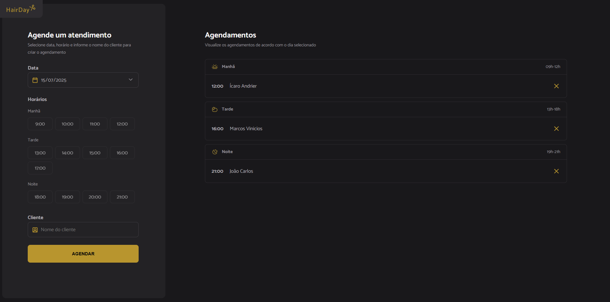

# HairdaySchedule



Uma **aplicação web de agendamento para corte de cabelo**, que permite ao usuário selecionar data e horário, informar o nome do cliente e visualizar ou cancelar agendamentos divididos em períodos do dia (manhã, tarde e noite).

---

## 📋 Sumário

- [HairdaySchedule](#hairdayschedule)
  - [📋 Sumário](#-sumário)
  - [🚀 Funcionalidades](#-funcionalidades)
  - [🛠️ Tecnologias](#️-tecnologias)
  - [📦 Pré-requisitos](#-pré-requisitos)
  - [⚙️ Instalação](#️-instalação)

---

## 🚀 Funcionalidades

- **Criar agendamento**:

  - Escolha de data (não permite datas passadas) e hora disponível
  - Preenchimento do nome do cliente
  - Confirmação de sucesso no cadastro

- **Visualizar agendamentos**:

  - Listagem automática de horários ocupados por dia
  - Exibição separada em “Manhã” (09h–12h), “Tarde” (13h–18h) e “Noite” (19h–21h)

- **Cancelar agendamento**:
  - Ícone de cancelamento em cada item
  - Confirmação antes de excluir
  - Mensagem de sucesso ao cancelar

---

## 🛠️ Tecnologias

- **JavaScript** (ES6+)
- **HTML5 & CSS3**
- **[Webpack](https://webpack.js.org/)** + **Babel** para empacotamento e transpile
- **[dayjs](https://day.js.org/)** para manipulação de datas
- **[json‑server](https://github.com/typicode/json-server)** como API fake de back‑end

---

## 📦 Pré-requisitos

- **Node.js** ≥ 14
- **npm** (ou **yarn**)

---

## ⚙️ Instalação

1. Clone este repositório
   ```bash
   git clone https://github.com/jrcarlos99/HairdaySchedule.git
   cd HairdaySchedule
   ```
